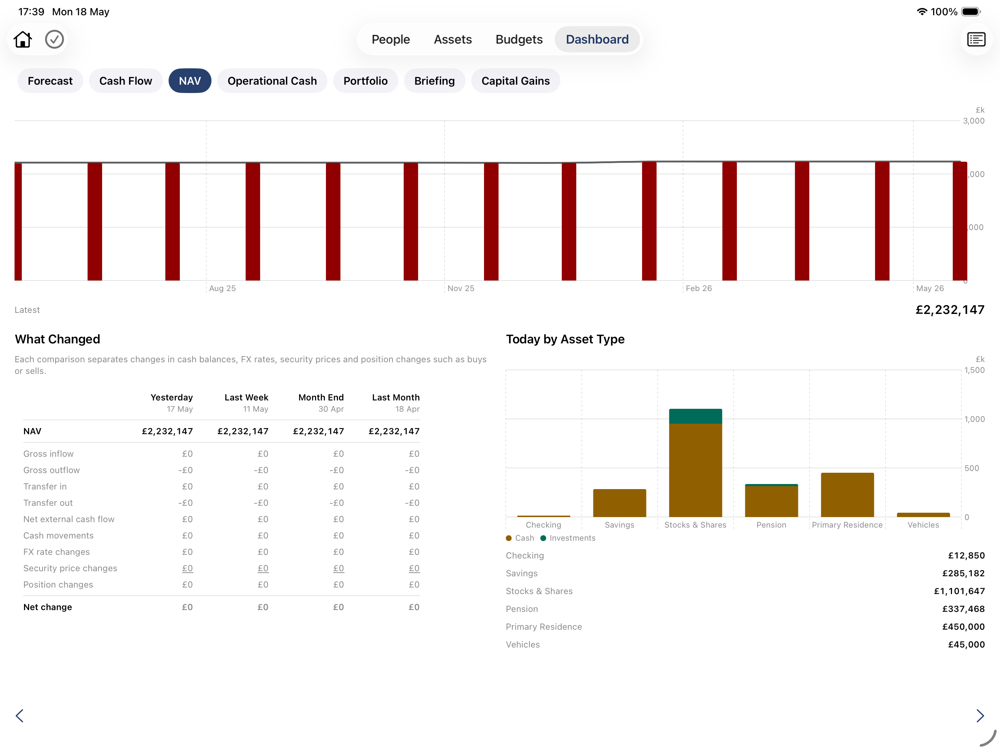

# Net Worth & Performance

The Net Worth & Performance reports give you a clear picture of where you stand today and how you have got here. Unlike the forecast, which looks ahead, these reports are grounded in your actual asset values and transaction history.

---

## Net Asset Value (NAV)

The NAV report shows your total net worth over time — the combined value of all your assets, converted to your base currency.

You can view it over any date range and drill into individual asset types to see how each has contributed to your overall position. Month-by-month and year-by-year views let you track progress over time.

  *Net Asset Value.*

---

## Portfolio

The Portfolio report shows the current composition of your investment holdings — which securities you hold, in what quantities, and at what value.

For each holding you can see:

- Current market value
- Quantity held
- Average cost basis
- Unrealised gain or loss
- Weight within the overall portfolio

---

## Net Worth

The Portfolio Briefing is a summary view of your portfolio's overall status — total value, performance over different time horizons, and a high-level breakdown by asset type.

---

## Investment Summary

Individual assets show their own performance history: opening balance, closing balance, and the transactions that drove the change. For investment assets, this includes the return rate achieved compared to the rate assumed in your forecast.

---

## Customising your view

Reports can be added to your dashboard as **favourites**, making them available as tabs for quick access. See [Report Builder](Report%20Builder.md) for how to configure and save custom reports.

---

> **Note:** The details of which specific charts and metrics appear in each report are worth verifying against the current app — some views may have evolved since this article was written.
